## Final Practice: 2D game prototype.
## Introduction

The project is a 2D side-scrolling platform game that will have a character who runs, jumps and avoids obstacles and needs to go from the beginning to the end of the level. It will have a little loading system so that when you finish a particular level it will load into the next level and so on using the unit TileMap system.

## Sprites
The first thing that has been done in the search for some sprites, these are the sprites used for this project:

 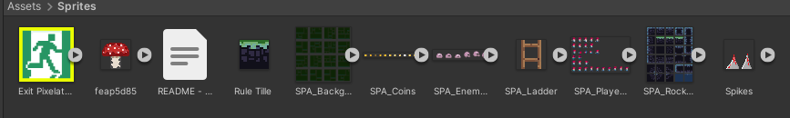
 
Once chosen, change the size of pixels per unit from 100 to 31, then change the sprite from single to multiple, I continued adjusting the slice of each pixel.
 
 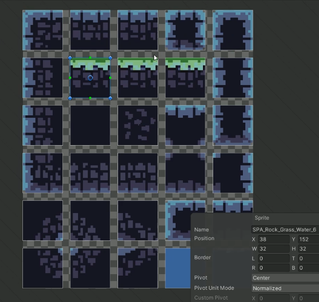
 
## TileMap
Throughout the development I was creating different TileMap capabilities for the design of the different levels, the capabilities are the following:
 
 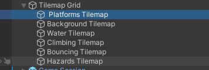
 
This is the TileMap as I have it in the project:

 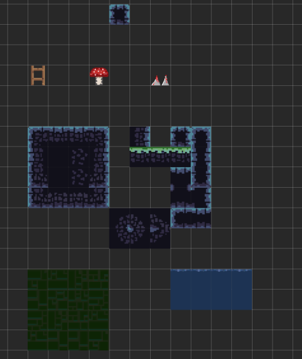

When I found different layers in the TileMap I adjusted them by adding different layers and assigning them to the different layers and thanks to the sorting layers I was able to adjust them at will. Here I show the different layers created and the order in which I assign them.

 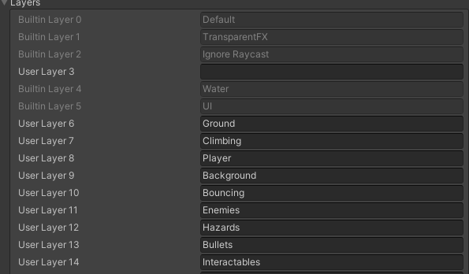

 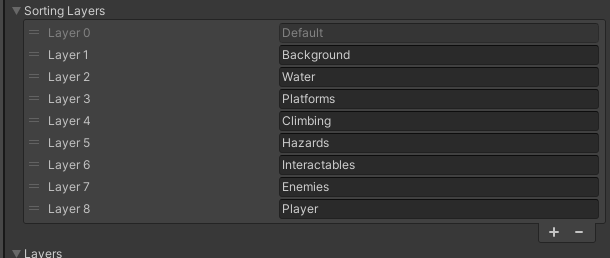
 
If you look at the first image I provide about the sprites I have created a Rule Tile , they are programmable tiles, which are smart enough to use the appropriate adjacent tiles and handle tile animation, bounds and collisions on the fly. This has been one of the most difficult parts to carry out, since implementing the logic of how the level should be was quite imaginative, but in the long run it is something that has helped me learn and optimize the time in level design. Here I show you how I did the Tiling Rules
 
 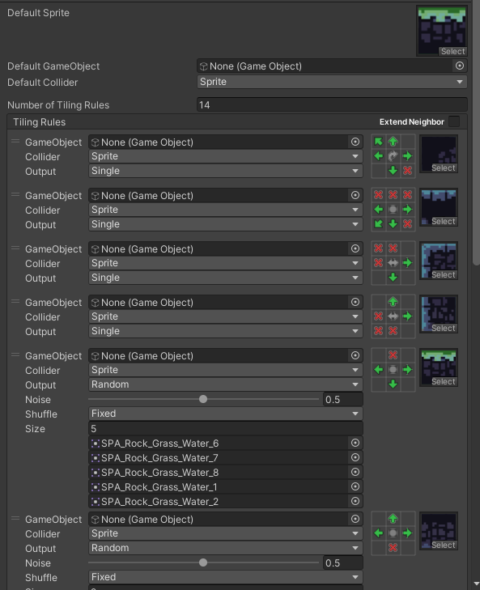

 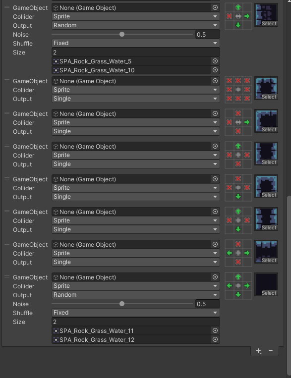
 
## Animations
Once the TileRules logic is implemented, move on to the character animations, which are handled by the player, just as we were taught in class, we assign the different sprites that we will use for the animation, creating an animation, then creating an animator controller to define the different states through which the player will pass, always remember that when creating an animation we must activate the loop time option. In this particular case of the palyer, since it will have the states of Idle, Climbing, Running and Death, this logic that I comment on, as can be seen in the image, was applied to the different interactive elements that the player will see, in this case the enemies and the coins you collect.

  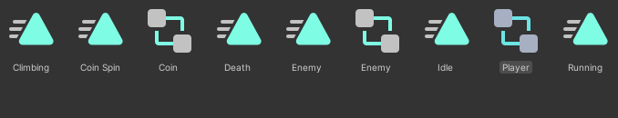
  
  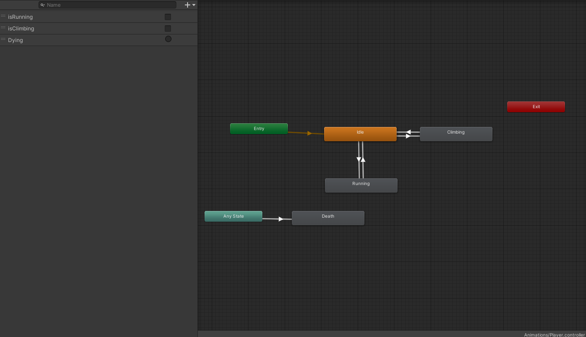
  
## Collisions
Now we find that the character must interact with the map, as far as I have explained it is not possible, since we must apply collisions on the map, in this case I apply them on the Platforms Tilemap layer, adding a 2D Tilemap Collider and a Composite Collider2D which in turn adds a RigidBody2D that we are going to leave in Static, this also implies adding a collider2D to the player which in this case is a Capsule Collider 2D, which is adjusted to the size of the sprite, together with a Rigidbody2D marking the Freeze Rotation Z option, as we saw in class.

  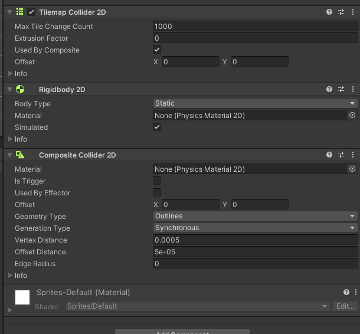
  
  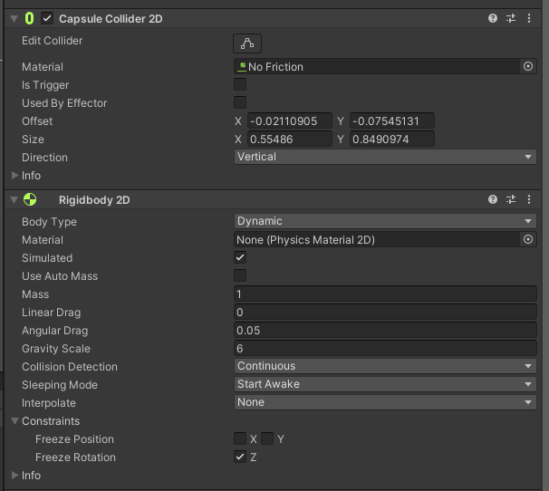

## Input System
For the player controls I have decided to apply an input system by installing the package manager of the same name, to apply it we give the create actions option once we add it as a component to the player, it has some actions defined by default such as movement and shooting. In this case I added the jump action with the spacebar, to apply it I create the PlayerMovement script, it uses the InputSystem to detect player input and updates the player movement and animation accordingly.

  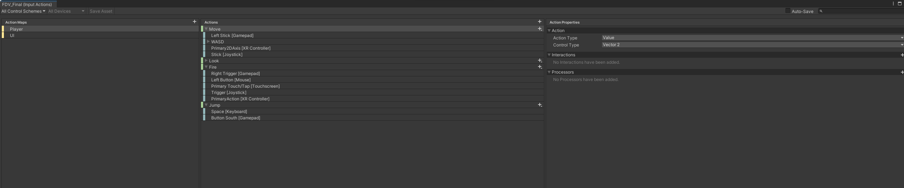
  
  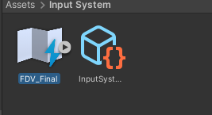
 
  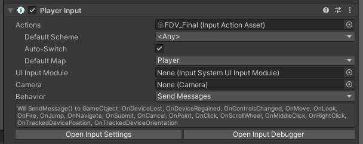

## Player
At this point we already have the animations, so we must apply in this script the different actions that the player will do, including correcting the flip of the character, the movement and the jump.

That's why the PlayerMovement script includes methods to run, flip the sprite, climb stairs, shoot, jump, and die.
Run() is the method that takes care of updating the character's speed based on player input. FlipSprite() is the method that is responsible for flipping the character's sprite when it changes direction. ClimbLadder() is the method that is responsible for updating the speed and gravity of the character when it is climbing. OnFire() is the method that is responsible for generating a bullet when the player presses the fire button. OnMove() is the method that takes care of getting input from the player's movement. OnJump() is the method that is responsible for updating the speed of the character when the player presses the jump button and finally Die() is the method that is responsible for killing the character when it collides with enemies or hazards.

  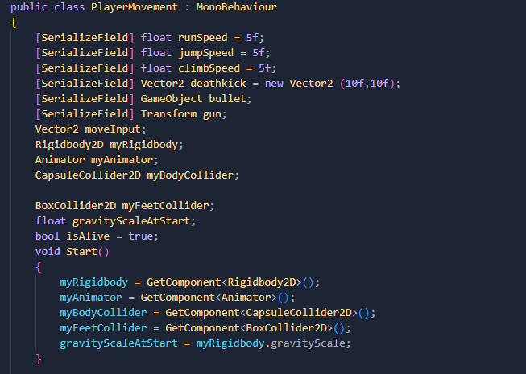
  
In the Update() method it is verified if the character is alive, if it is alive the Run(), FlipSprite(), ClimbLadder() and Die() methods are called.

  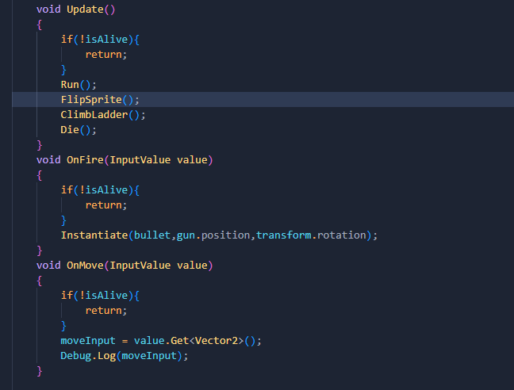

To prevent the player from jumping indefinitely, we take advantage of the layers, and we adjust how the character can interact, for this I create a layer called ground, so that the character can jump when he is only touching the ground, as can be seen in the image above in the OnJump function. I also leave here how I have adjusted the interactions of the layers.

  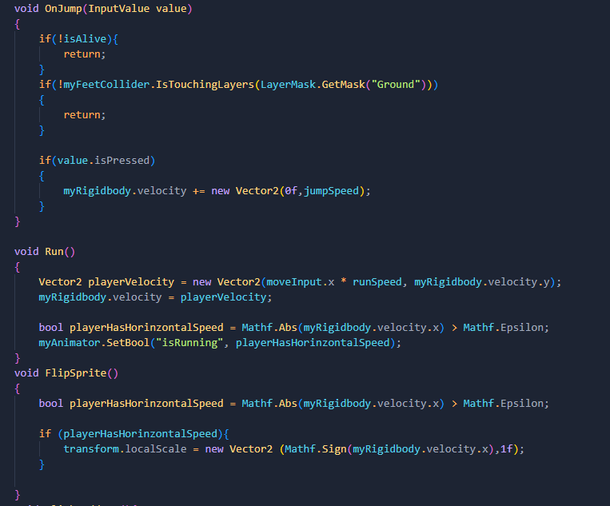
  
  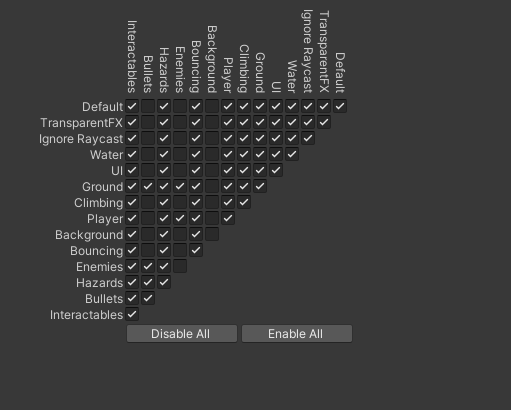
  
The ClimbLadder() method. It starts by checking if the player's feet collider is not touching a layer that is marked as "Climbing" using the IsTouchingLayers() method and the LayerMask.GetMask("Climbing") function. If it is not touching the climbing layer, it sets the gravity scale of the rigidbody to the gravity scale at the start of the game, sets the "isClimbing" boolean in the animator to false and exits the method.

If the player's feet are touching the climbing layer, it calculates a new climb velocity by taking the current x velocity of the rigidbody and the y input of the player multiplied by the climb speed. Then it sets the velocity of the rigidbody to this new climb velocity, sets the gravity scale of the rigidbody to 0 and sets the "isClimbing" boolean in the animator to true if the player has a non-zero y velocity.

The climbing animation so its plays when the player climbs the ladder. If the player is stationary on the ladder, the climbing animation not play.

  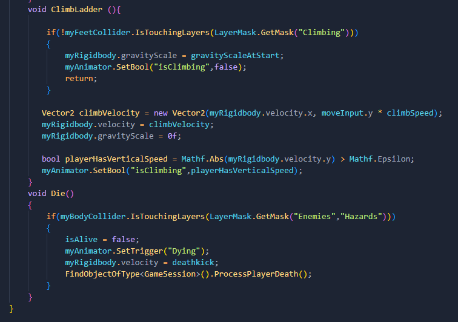
  
The Die() method. It starts by checking if the player's body collider is touching a layer that is marked as "Enemies" or "Hazards" using the IsTouchingLayers() method and the LayerMask.GetMask("Enemies","Hazards") function. If it is touching either of those layers, it sets the isAlive boolean to false, triggers the "Dying" animation, sets the velocity of the rigidbody to the deathKick Vector2, and calls the ProcessPlayerDeath() method on the GameSession object.

The deathKick Vector2 is a variable that is set in the inspector, it is a force that push the player away when it dies. The ProcessPlayerDeath() method is a method from the GameSession script, it's probably responsible for handling the game over logic, such as displaying a game over message or reloading the level.
In this project the CinemaMachine has been used to control different cameras.

## CinemaMachine
I have added a component called CinemachineStateDrivenCamera, which has 3 different cameras as children that correspond to the different states of the character, that is, we have a RunCamera, Idle Camera and LadderCamera, these cameras we add a cinemachine confiner to prevent the camera from leaving the map of the different levels, for this in the Background Tilemap I have added a 2D Polygon Collider and I have adjusted it to the edges of the map.
With the CinemachineStateDrivenCamera we can decide from which state to which other state we want our cameras to change as can be seen in the following image.
 
 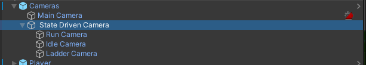
  
 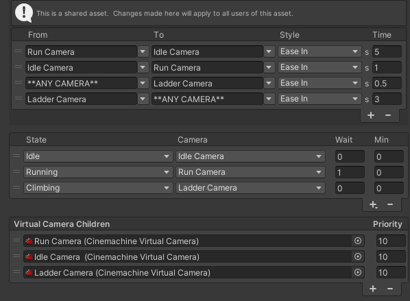
 
 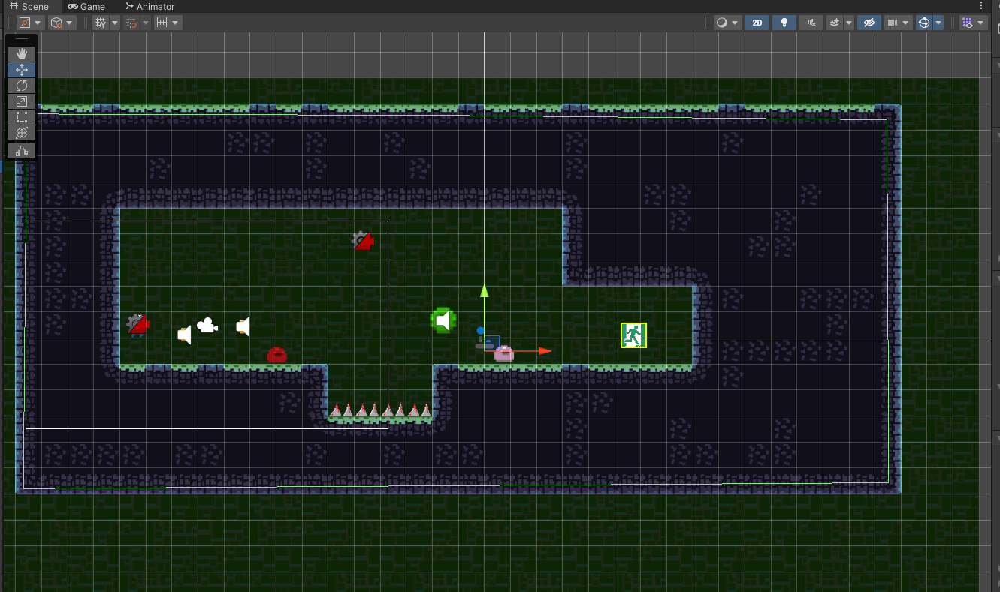
 
 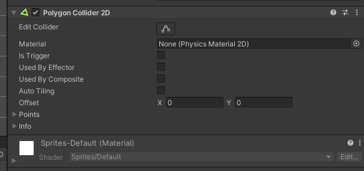
 
 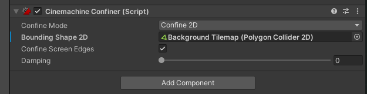
 
## 2D Physical Objects
In the project, 2D physical objects have been used, in this case a mushroom to generate a greater jump for the player to reach places that he cannot reach with the normal jump, that is, he climbs and begins to bounce, for this create another layer in my TileMap called Bouncing, once I created the 2D physical object and adjusted the bouncing I added it to the Tilemap coleader of the Bouncing Tilemap.
 
 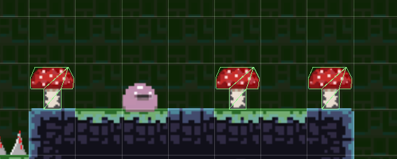
 
 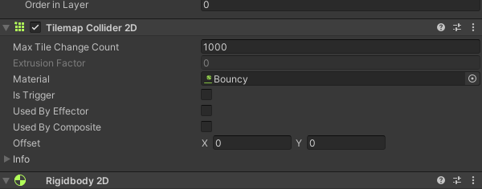
 
 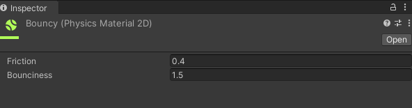

## Fix Jump
Something that I have not mentioned is that when the player jumped near a wall he could jump indefinitely, so I created another 2D physical object that had 0 friction to add it to the player and avoid that failure, and for more precision I added a box 2D collider for feet only, that's why in the player code I have myBodyCollider and myFeetCollider, in the Jump and ClimbLadder function it is modified for feet only.

 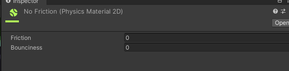
 
 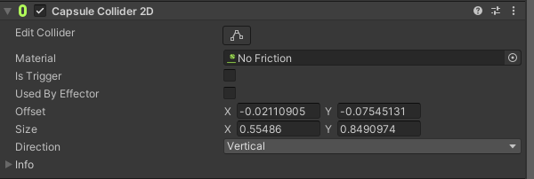
 
 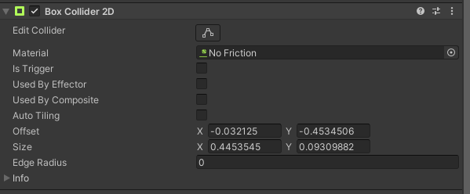
 
 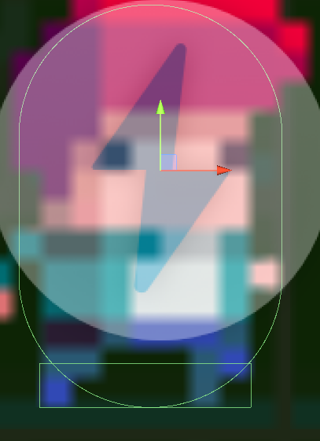
 
## Enemies
For the creation of the enemies I have followed the same methodology as with the player, it has its own layer called Enemies, the only thing to highlight is that I add a 2D Box Collider to detect the collision with the walls so that it flips and turns On the other hand, marking that Box Collider as is Trigger, this is reflected in the EnemieMovement script.

 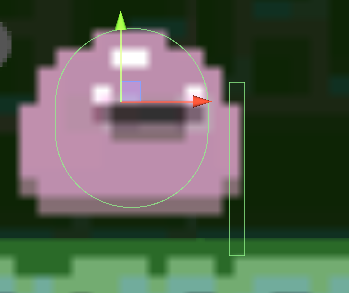
 
In the Start() method, the script obtains the Rigidbody2D component from the enemy's game object and assigns it to the myRigidbody variable. In the Update() method, the script sets the velocity of the enemy's rigidbody to a new Vector2 with the x component set to the moveSpeed variable and the y component set to 0, this makes the enemy to move horizontally.

In the OnTriggerExit2D() method, when the enemy collider exits a trigger, it changes the moveSpeed variable to its negative, this causes the enemy to move in the opposite direction, and calls the FlipEnemyFacing() method.

In the FlipEnemyFacing() method, the script changes the localScale of the enemy's game object to a new Vector2 with the x component set to the opposite of the current x velocity of the rigidbody, this causes the enemy's sprite to flip horizontally and face the direction in which it is moving.

 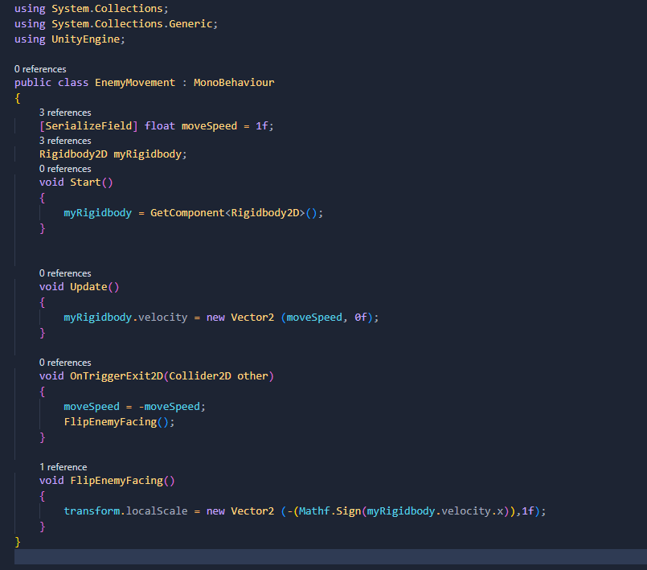
 
## Hazards
As a new element on the map, a new layer has been added to the Tilemap called hazards, which is where we will place the spikes where when touching them the player will die, following the same as explained so far with the enemy.

 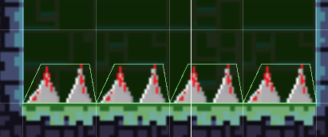
 
## Bullets
Something that we have overlooked is that the player has the possibility of shooting as you will have already observed in the images of the playermovement script, this has been done by creating an empty object which we place in front of the player, the bullets will be sprites of the player himself but in red, using the input system that will be assigned to the shot by the left click of the mouse, I turn the bullets into a prefab to this prefab I add the bullet script. 

 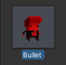
 
 
 
 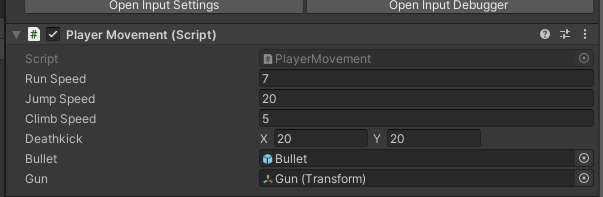
 
The bullet script in the Start() method, the script obtains the Rigidbody2D component from the bullet's game object and assigns it to the myRigidbody variable, it also get a reference to the player gameobject using FindObjectOfType<PlayerMovement>() method, and it sets the xSpeed variable by multiplying the player's localScale.x by the bulletSpeed variable.

In the Update() method, the script sets the velocity of the bullet's rigidbody to a new Vector2 with the x component set to the xSpeed variable and the y component set to 0, this makes the bullet to move horizontally in the direction the player is facing.

In the OnTriggerEnter2D() method, when the bullet collider enters a trigger, it checks if the trigger object has the "Enemy" tag, if it has it destroys the object, and finally it destroys the bullet gameobject.

In the OnCollisionEnter2D() method, when the bullet collider enters a collision with another object, it destroys the bullet gameobject.
 
 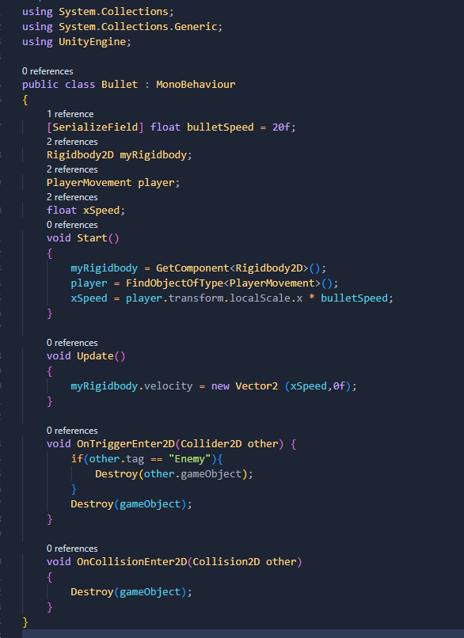
 
## Levels
  The levels designed are the following:
 
  level 1
 
  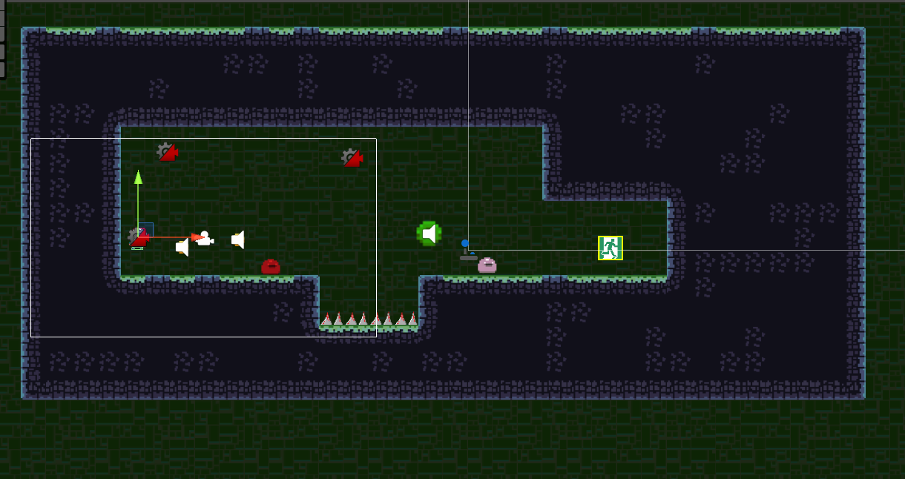
 
  level 2
 
  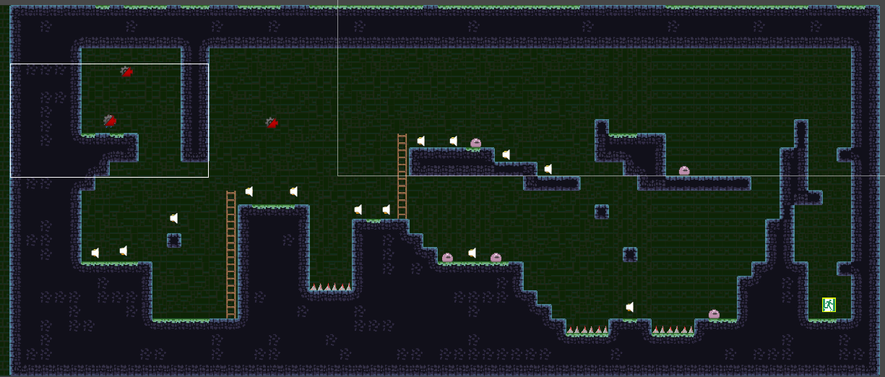
 
  level 3
 
  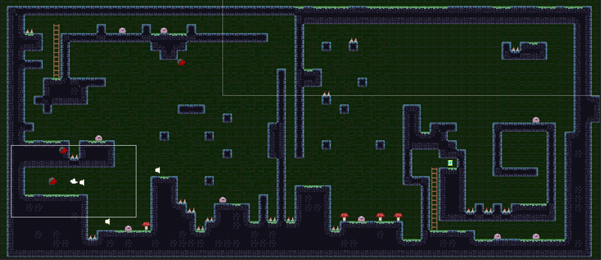
 
